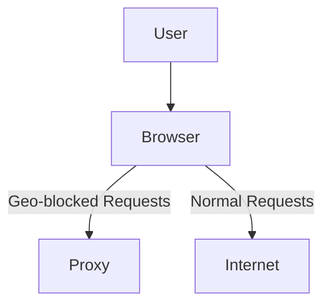
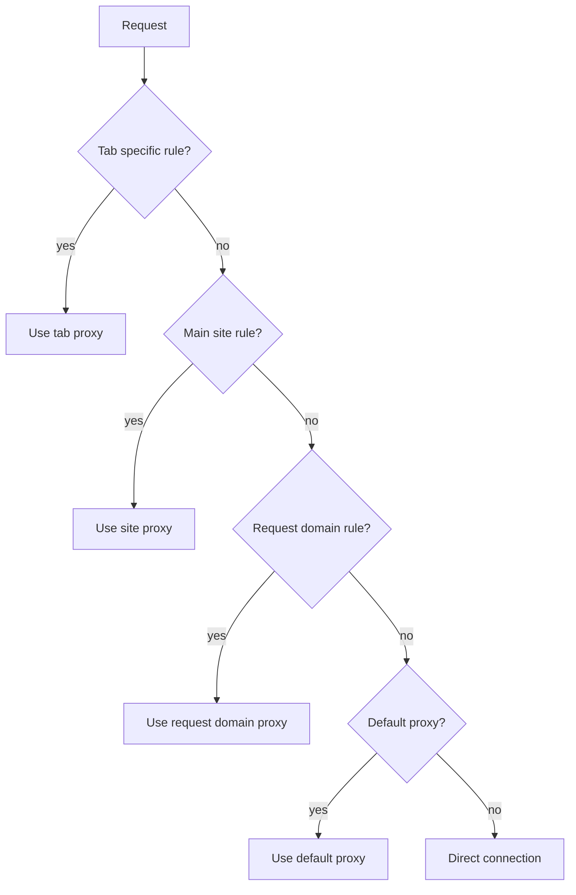

# GeoBypass

GeoBypass is an experimental browser extension that routes only geo restricted requests through a configured proxy.  Other requests continue directly so the browsing and streaming experience stays fast.



## Features

- Proxy list with per-tab assignment *(not available on Chrome/Chromium)*
- Domain-based overrides *(not available on Chrome/Chromium)*
- Flexible matching rules with bypass and force patterns
- Optional keep-alive monitoring for proxies
- Network inspection with a collapsible usage tree and auto-refresh

## Prerequisites

* Node.js (>= 18)
* npm

## Building

Install dependencies and build a development version for Firefox:

```bash
npm install
npm run build:dev:firefox
```

For Chrome use:

```bash
npm run build:dev:chrome
```

See `package.json` for production build and packaging commands.

## Rule hierarchy

Proxy selection follows these rules:

1. **Tab specific rule** – If a tab is assigned a proxy, it takes priority. **All network requests** from that tab will be proxied.
   > Not available on Chrome/Chromium due to limited proxy control
2. **Main site rule** – If the tab URL's domain matches a configured rule, the proxy from that rule is used. **All network requests** from that tab will be proxied.
   > Not available on Chrome/Chromium due to limited proxy control
3. **Request domain rule** – If the request URL matches an existing rule, **only those specific requests** will be proxied.
4. **Default proxy** – Used when no other rule matches.
5. **Direct connection** – Used when no proxy rules apply.



## Popup usage

The extension provides a small popup for quick per‑tab control.

- The header shows the active tab's domain and which proxy is currently applied (tab or site rule).
- Choose a proxy from the dropdown and press **Set for Tab** to apply it to the active tab.
- Press **Set for Site** to assign the selected proxy to the current domain.
- Select **Direct** in the dropdown to force a direct connection for the tab or domain.
- Use **Clear Tab** to remove the proxy override for the active tab.
- Use **Clear Site** to remove a domain override for the current website.
- **Test Proxy** runs a short connectivity test on the selected proxy and shows the result.
- "Open Dashboard" opens the full settings page for advanced options.
- The popup remains open after actions for quick adjustments.

## Running tests

```bash
npm test
```

---

## 🌐 Browser Support

* **Firefox**: [Add-on Page](https://addons.mozilla.org/en-US/firefox/addon/geobypass/)

* **Chrome**: *(Coming soon)*
  Extension is in development and will be released on the Chrome Web Store shortly.

---
