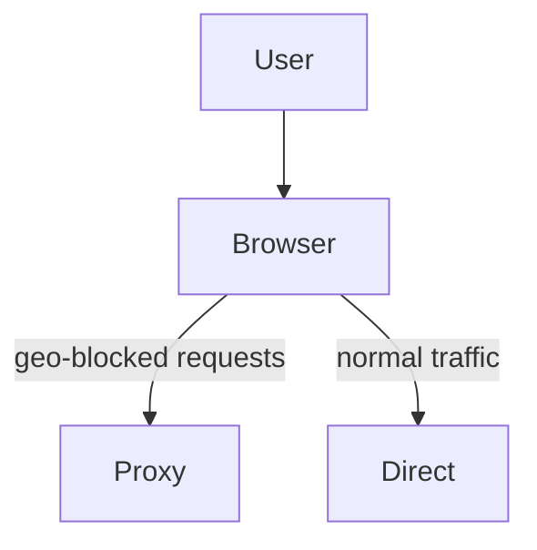
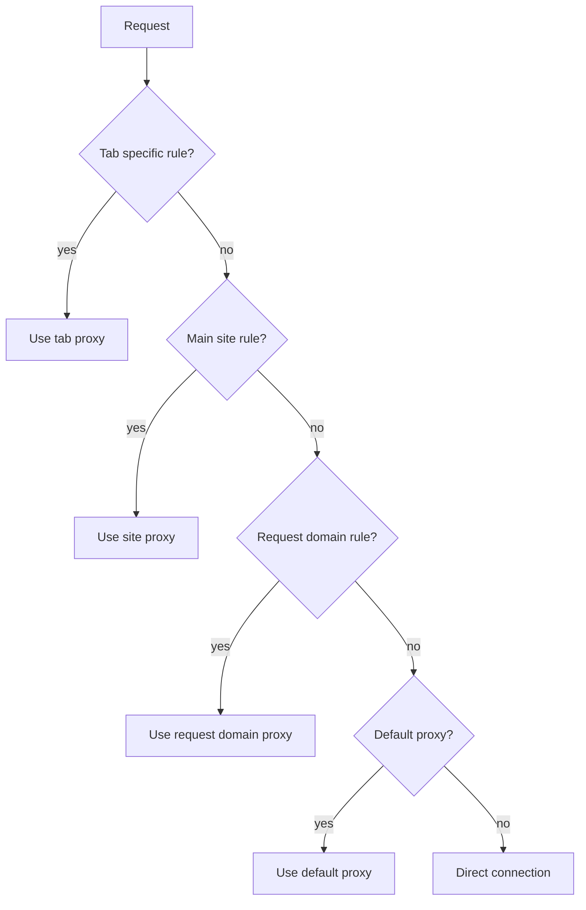

# GeoBypass

GeoBypass is an experimental browser extension that routes only geo restricted requests through a configured proxy.  Other requests continue directly so the browsing and streaming experience stays fast.



## Prerequisites

* Node.js (>= 18)
* npm

## Building

Install dependencies and build a development version for Firefox:

```bash
npm install
npm run build:dev:firefox
```

For Chrome use:

```bash
npm run build:dev:chrome
```

See `package.json` for production build and packaging commands.

## Rule hierarchy

Proxy selection follows these rules:

1. **Tab specific rule** – if a tab is assigned a proxy it takes priority.
2. **Main site rule** – if the tab URL's domain matches a configured rule the proxy from that rule is used.
3. **Request domain rule** – existing rules that match the request URL.
4. **Default proxy** – used when no other rule matches.
5. Direct connection otherwise.



## Running tests

```bash
npm test
```
